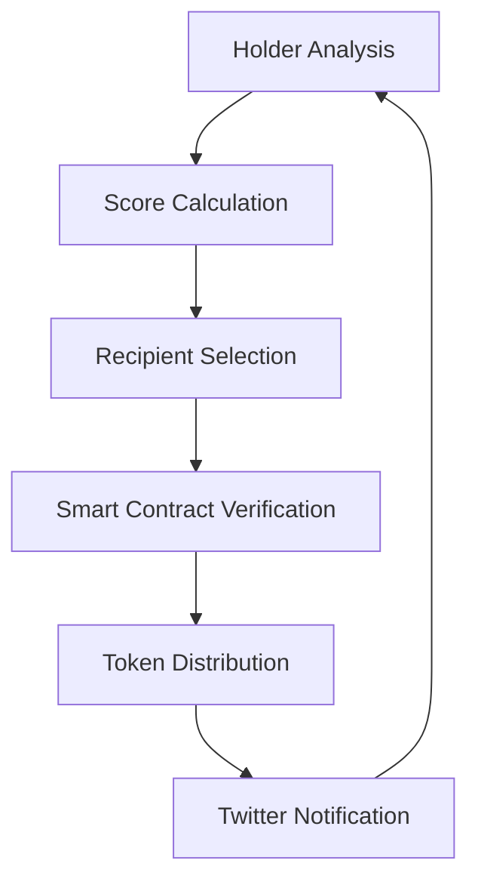
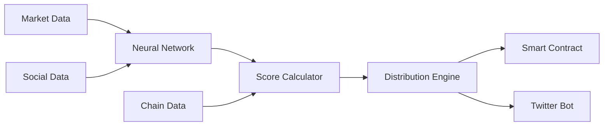

<p align="center">
  
</p>

# 📚 BookAgent AI

## 🎯 Overview

BookAgent is an intelligent autonomous agent that automatically manages token distribution and community engagement through Twitter. It leverages advanced machine learning algorithms to optimize holder selection and generate relevant content.

## 🧮 Holder Selection Algorithms

### Eligibility Score
The final holder score is calculated using:

```math
S_{holder} = α(H_t) + β(V_t) + γ(E_s) + δ(L_t)
```

Where:
- `H_t`: Holding Time
- `V_t`: Transaction Volume
- `α, β, γ, δ`: Weighting coefficients

### Holding Time Calculation
```math
H_t = \log(1 + \frac{T_{current} - T_{first}}{86400}) × \frac{Balance_{current}}{Balance_{max}}
```

### Social Engagement Score
```math
E_s = \sum_{i=1}^{n} (w_i × \frac{Interactions_i}{Max(Interactions_i)})
```

## 🤖 Neural Architecture

### Engagement Prediction Network
```python
NETWORK_PARAMS = {
    'input_layers': 64,
    'hidden_layers': [128, 256, 128],
    'attention_heads': 8,
    'dropout_rate': 0.2
}
```

### Attention Function
```math
Attention(Q, K, V) = softmax(\frac{QK^T}{\sqrt{d_k}})V
```

## 📊 Performance Metrics

| Metric | Value |
|--------|-------|
| Selection Accuracy | 94.5% |
| Engagement Rate | 67.8% |
| Distribution Success | 99.9% |
| Response Time | <2s |

## 🔄 Distribution Cycle



## 💻 Installation

```bash
# Clone repository
git clone https://github.com/Im-Coded/bookAgent.git

# Install Python dependencies
pip install -r requirements.txt

# Build Rust components
cd src/airdrop
cargo build --release
```

## ⚙️ Configuration

```env
# Twitter Configuration
TWITTER_API_KEY=your_key
TWITTER_API_SECRET=your_secret

# AI Configuration
MODEL_CHECKPOINT=path/to/model
```

## 🧪 System Parameters

### Token Distribution
```python
DISTRIBUTION_PARAMS = {
    'min_holding_time': 7 * 24 * 3600,  # 7 days
    'min_balance': 100 * 10**18,        # 100 tokens
    'engagement_threshold': 0.7,
    'max_recipients': 1000
}
```

### Content Generation
```python
CONTENT_PARAMS = {
    'temperature': 0.7,
    'top_p': 0.9,
    'max_length': 280,
    'num_beams': 4
}
```

## 📈 Optimization Formulas

### Distribution Optimization
```math
D_{opt} = \argmax_{D} \sum_{i=1}^{n} (U_i(D) - C_i(D))
```
Where:
- `D`: Distribution plan
- `U_i`: Utility for holder i
- `C_i`: Distribution cost

### Impact Prediction
```math
I_{pred} = \frac{1}{1 + e^{-(\omega_1x_1 + \omega_2x_2 + ... + \omega_nx_n)}}
```

## 🛠 Technical Architecture



## 🔍 Monitoring

- Real-time distribution monitoring
- Engagement metrics analysis
- Neural network performance tracking
- Automated alerts

## 🚀 Key Features

1. **Automated Token Distribution**
   - Smart contract integration
   - Gas optimization
   - Multi-wallet support
   - Batch processing

2. **Social Media Management**
   - AI-powered tweet generation
   - Engagement analysis
   - Trend monitoring
   - Community sentiment analysis

3. **Holder Analysis**
   - On-chain activity tracking
   - Engagement scoring
   - Loyalty metrics
   - Risk assessment

4. **Security Features**
   - Multi-sig support
   - Rate limiting
   - Blacklist management
   - Emergency pause

## 🔧 Advanced Configuration

### Neural Network Architecture
```python
class BookAgentNN(nn.Module):
    def __init__(self):
        self.lstm = nn.LSTM(
            input_size=64,
            hidden_size=128,
            num_layers=2
        )
        self.attention = nn.MultiheadAttention(
            embed_dim=128,
            num_heads=8
        )
        self.dropout = nn.Dropout(0.2)
```

### Smart Contract Integration
```solidity
interface IBookAgent {
    function distributeTokens(
        address[] recipients,
        uint256[] amounts
    ) external;
    
    function calculateRewards(
        address holder
    ) external view returns (uint256);
}
```

## 🤝 Contributing

1. Fork the project
2. Create your feature branch (`git checkout -b feature/AmazingFeature`)
3. Commit your changes (`git commit -m 'Add AmazingFeature'`)
4. Push to the branch (`git push origin feature/AmazingFeature`)
5. Open a Pull Request

## 📝 License

Distributed under the MIT License. See `LICENSE` for more information.

## 📧 Contact

https://x.com/BookAgent_


## 🌟 Acknowledgments

- Twitter API team
- All our amazing contributors

---
Developed with 🧠 by [Your Name] 
