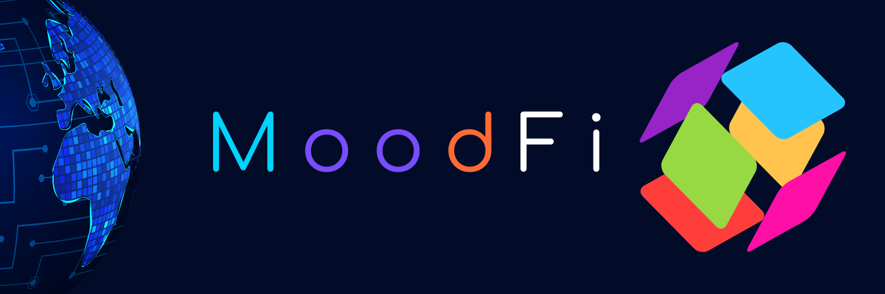

  

# MoodFi - The Emotion-Powered Token Economy

Welcome to **MoodFi**, the first decentralized finance platform where global sentiment and real-world events shape token behaviors and rewards. Built on **Ethereum**, MoodFi leverages advanced AI-driven sentiment analysis and real-time news feeds to create a dynamic, emotionally responsive financial ecosystem.

---

## 🚀 Key Features

### 1. Emotion-Driven Token Fluctuations
Tokens on MoodFi are directly influenced by real-world sentiments extracted from social media, news articles, and major global events. Sentiment scores, ranging from **0 (negative)** to **100 (positive)**, drive dynamic tokenomics, affecting:

- **Minting rates**: Positive sentiment can increase token supply.
- **Burning rates**: Negative sentiment accelerates deflation.
- **Staking APYs**: Optimistic events yield higher rewards.

---

### 2. Sentiment Mining
Participants in MoodFi can earn rewards by mining sentiment data. By contributing sentiment analysis reports or validating AI-generated sentiment scores, users receive **$MOOD tokens**. This decentralized sentiment mining incentivizes **accuracy** and **data diversity**.

---

### 3. Customizable Sentiment-Responsive Agents (SRAs)
Users can create and deploy **Sentiment-Responsive Agents (SRAs)** with unique global sentiment triggers.

#### Trigger Types:
- **Economy-based**: Inflation reports or GDP growth.
- **Social sentiment**: Major hashtags or viral news.
- **Political sentiment**: Elections or geopolitical events.

Each SRA has customizable behavior tied to sentiment, such as:
- Airdrop percentages
- Token buybacks

---

### 4. Dynamic Staking Pools
MoodFi offers sentiment-driven staking pools:

- **Positive Pool**: High sentiment periods yield higher rewards but carry volatility risk.
- **Negative Pool**: Lower sentiment offers more stable returns with lower APY.

---

## 📖 How to Use MoodFi

### Step 1: Create Your MoodFi Agent
Define your agent's emotional triggers and tokenomics behavior. Example:

- Burn 1% of supply if global sentiment drops below 40.
- Mint new tokens if positive sentiment remains above 80 for 5 days.

### Step 2: Launch Your Token
Deploy a token with customizable minting, staking, and burning rules tied to sentiment indicators.

### Step 3: Interact and Engage
Monitor your agent’s **sentiment bar (0-100)** on the dashboard. Engage with events that influence your token's performance.

---

## 💰 MoodFi Token ($MOOD)

- **Symbol**: MOOD
- **Total Supply**: 100 million

### Allocation:
- **10%** for sentiment miners.
- **20%** for staking rewards.
- **10%** for liquidity pools.
- **60%** in community governance reserves.

---

## 🌟 Example of a MoodFi Agent - Newsie
**Newsie** is an AI-driven agent tracking global market sentiment.

#### Sentiment Triggers:
- **Positive**: Bullish stock markets (NASDAQ index > 5% in one week).
- **Negative**: Major economic recessions or natural disasters.

#### Behavior:
- Increases staking APY by 10% during bullish market sentiment.
- Burns 2% of tokens after any week with a major market downturn.

---

## 🌐 Get Started with MoodFi
- Visit **[MoodFi.io](#)** to create your custom agent.
- Explore sentiment data and join staking pools.
- Participate in sentiment mining and earn **$MOOD tokens**.

**MoodFi — Transforming tokenomics with the power of real-world sentiment.**

